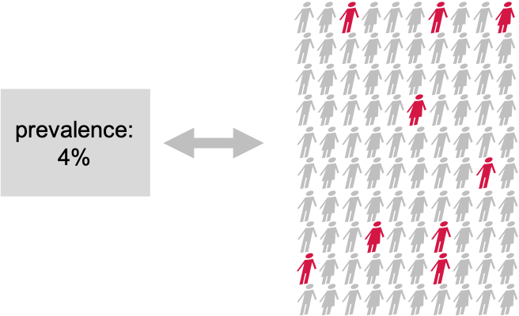

:::::::::::::::::::::::::::::::::::::: questions
- What is multiple testing?
::::::::::::::::::::::::::::::::::::::::::::::::

::::::::::::::::::::::::::::::::::::: objectives
- Define multiple testing 
::::::::::::::::::::::::::::::::::::::::::::::::
# What is multiple testing
Suppose the prevalence of a disease in the general population is 4%. In this population, lives a group of individuals who share a common trait – they are all overweight. Concerned about their health, we decide to embark on a quest to uncover whether being overweight influenced the risk of contracting this disease.



## Setting the null and alternative hypothesis

### Null Hypothesis (H)
The prevalence of the disease within the overweight test group is the same as the known prevalence in the general population (4%). This means that the proportion of overweight individuals in the test group who have the disease is also 4%.

### Alternative Hypothesis (H₁)
The prevalence of the disease within the overweight test group is different from the known prevalence in the general population. This suggests that the proportion of overweight individuals in the test group who have the disease is either significantly higher or lower than 4%.

## Data collection and testing
We assemble a group of 100 overweight individuals (test group) from the population and each individual is carefully examined, checking for any signs of the disease.
Out of the 100 individuals, we discover that 9 of them were indeed suffering from the disease.
But we are not satisfied with just this knowledge. We want to know if this prevalence of the disease within the overweight group was significantly different from the population's average, which is 4.
So, we decide to perform binomial test (please refer back to binomial tests tutorial). With this test, we could compare the observed prevalence within our overweight group to the known prevalence in the entire population.

We set our significance level (α) beforehand, typically at 0.05, to determine whether the results are statistically significant.

```{r binomial_test_done}
#For known parameters (n=100, p=0.04), he calculates the the chances of getting the 9 individuals that indeed suffered from the disease. 
n = 100 # number of test persons
p = 0.04 # Known prevalence of the disease in the general population
dbinom(x=9, size=n, prob=p)
```
The binomial test calculates the probability of observing the obtained (9 persons with a disease) or more extreme results assuming the null hypothesis is true. If this probability is sufficiently low (below our chosen significance level), we reject the null hypothesis in favor of the alternative hypothesis.

The binomial test result reveals that the prevalence of the disease among the overweight individuals was indeed significantly different from that of the population.

We develop more interest to fully understand the statistical tools (hypothesis testing)we have used. We want to know how how hypothesis testing works, especially if we wanted to compare many different groups. We therefore decide to run a 200 simulated experiments where we assume there was no real difference in disease rates between our overweight group and the average for the whole population.


To do this, we write a program in r, which would give us the simulated results when the prevalence in the test group is 4% (null hypothesis is true). We run these experiments to see what would happen if we kept doing tests even when there was not actually any difference. 

```{r Simulating 200 test groups}
#H0 is true: disease prevalence = 4%
library(tidyverse)
set.seed(33)

data <- table(rbinom(n=200,size=100,prob=0.04)) %>%
  data.frame() %>%
  mutate(number = as.numeric(as.character(Var1))) %>%
  mutate(sign = ifelse((number>8)|(number<1), 1,0))

data %>%
  ggplot(aes(Var1,Freq, fill=sign)) +
  geom_col()+
  theme_bw()+
  labs(x="number of patents with disease",y="frequency")

```

The figure above show simulated results when the prevalence in the test group is 0.04, and when null hypothesis is true. To our astonishment, we find that even in a world where there was no true difference in disease prevalence, about 5% of our simulated experiments yielded statistically significant results purely by chance (the light blue bars). Therefore, by running lots of experiments, we see how often we got results that looked like there was a difference, just by random chance. Thus, it is very likely  for us to make a mistake and think there is a difference when there really is not. 

## Key point
- Through this exercise, we learn a valuable lesson about the dangers of multiple testing.
- We realize that without proper adjustments, the likelihood of encountering false positives (rejecting a true null hypothesis) increase with each additional comparison.
- We need some additional control to make sure we found more hits than expected by chance.

 
## So what is multiple testing?

Multiple testing refers to the practice of conducting numerous hypothesis tests simultaneously or repeatedly on the same data set.It is typically motivated by the desire to explore different aspects of the data or to investigate multiple hypotheses. Researchers employ multiple tests to examine various relationships, comparisons, or associations within their dataset, such as comparing means, proportions, correlations, or other statistical analyses that involve hypothesis testing.

::::::::::::::::::::::::::::::::::::::::::::::::::::::::::::: instructor

Inline instructor notes can help inform instructors of timing challenges
associated with the lessons. They appear in the "Instructor View"

::::::::::::::::::::::::::::::::::::::::::::
